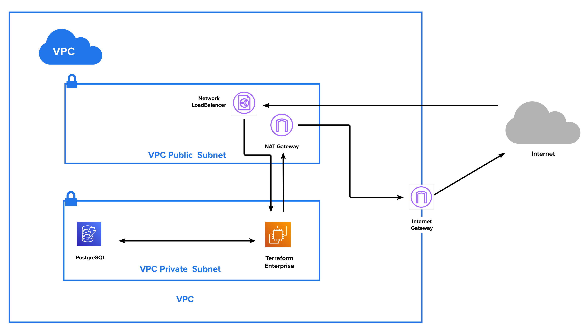

# Terraform Enterprise on AWS with two subnets - Public and Private and network Load Balancer for inbound connection
- Private subnet have an outbound route to the Public network - nat_gateway.
- Public subnet have a route to the Internet Gateway
- Private network should have inbound connection trough the network Load Balancer

## Overview

